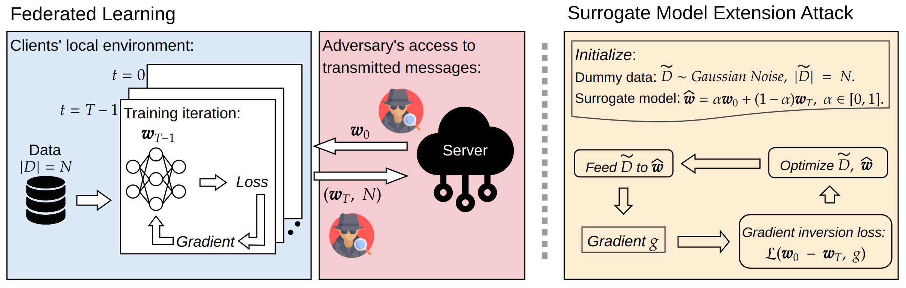
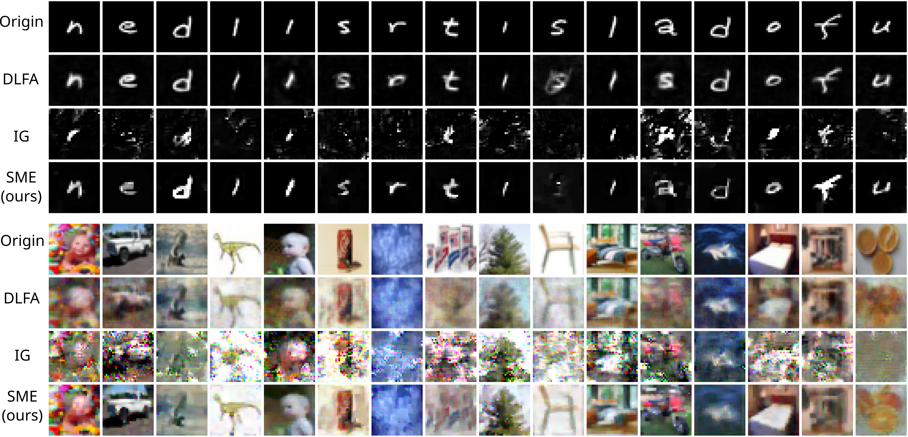

## Surrogate Model Extension (SME): A Fast and Accurate Weight Update Attack on Federated Learning [Accepted at ICML 2023]

### Abstract
In Federated Learning (FL) and many other distributed training frameworks, collaborators can hold their private data locally and only share the network weights trained with the local data after multiple iterations. Gradient inversion is a family of privacy attacks that recovers data from its generated gradients. Seemingly, FL can provide a degree of protection against gradient inversion attacks on weight updates, since the gradient of a single step is concealed by the accumulation of gradients over multiple local iterations. In this work, we propose a principled way to extend gradient inversion attacks to weight updates in FL, thereby better exposing weaknesses in the presumed privacy protection inherent in FL. In particular, we propose a surrogate model method based on the characteristic of two-dimensional gradient flow and low-rank property of local updates. Our method largely boosts the ability of gradient inversion attacks on weight updates containing many iterations and achieves state-of-the-art (SOTA) performance. Additionally, our method runs up to $100\times$ faster than the SOTA baseline in the common FL scenario. Our work re-evaluates and highlights the privacy risk of sharing network weights.

<p align="center">
      
</p>
<p align="center">
    <em>Figure 1: Illustration of the threat model (left) and working pipeline of our surrogate model extension (right). In FL, a client trains the received model w_0 for T iterations with local data set D of size N, then sends the weights and the number N back to the server. An adversary observes the messages and launches the SME attack through optimization of dummy data and surrogate model.</em>
</p>

<p align="center">
      
</p>
<p align="center">
    <em> Figure 2: Visualization of the reconstructed images. </em>
</p>


### Download
Make sure that conda is installed.
```sh
git clone git@github.com:JunyiZhu-AI/surrogate_model_extension.git
cd surrogate_model_extension
conda create -n sme python==3.9.12
conda activate sme
conda install pip
pip install -r requirement.txt
```
Prepare the FEMNIST dataset (preprocessing can take up to 30 minutes, take a break and have a coffee ☕).
```sh
mkdir data
cd data
git clone https://github.com/TalwalkarLab/leaf.git
cd leaf/data/femnist
./preprocess.sh -s niid --sf 0.05 -k 0 -t sample
cd ../../..
mv leaf/data/femnist .
rm -rf leaf
cd ..
```

### Run
To run the experiments, follow these instructions:

1. SME attack on a CNN training with CIFAR-100:
```sh
python3 -m experiments.run_experiment --config experiments/configs/cifar_sme.json
```

2. Vanilla gradient inversion attack on a CNN training with CIFAR-100:
```sh
python3 -m experiments.run_experiment --config experiments/configs/cifar_ig.json
```

3. SME attack on a CNN training with FEMNIST:
```sh
python3 -m experiments.run_experiment --config experiments/configs/femnist_sme.json
```

4. Vanilla gradient inversion attack on a CNN training with FEMNIST:
```sh
python3 -m experiments.run_experiment --config experiments/configs/femnist_ig.json
```

5. SME attack on a ViT training with FEMNIST:
```sh
python3 -m experiments.run_experiment --config experiments/configs/vit_sme.json
```

6. Vanilla gradient inversion attack on a ViT training with FEMNIST:
```sh
python3 -m experiments.run_experiment --config experiments/configs/vit_ig.json
```

7. Example of running an experiment by passing arguments directly (the following hyperparameters are not tuned and are for demonstration purposes only):
```sh
python3 -m experiments.run_experiment \
        --dataset FEMNIST \
        --model ResNet8 \
        --seed 42 \
        --batchsize 25 \
        --train_lr 0.004 \
        --epochs 50 \
        --k 50 \
        --alpha 0.5 \
        --eta 1 \
        --iters 2000 \
        --lamb 0.01 \
        --lr_decay True \
        --beta 0.001 \
        --test_steps 200
  ```
  Explanation for each argument can be found in the ```experiments/run_experiment.py``` file.

### Citation
```
@InProceedings{pmlr-v202-zhu23m,
  title = 	 {Surrogate Model Extension ({SME}): A Fast and Accurate Weight Update Attack on Federated Learning},
  author =       {Zhu, Junyi and Yao, Ruicong and Blaschko, Matthew B.},
  booktitle = 	 {Proceedings of the 40th International Conference on Machine Learning},
  year = 	 {2023},
  series = 	 {Proceedings of Machine Learning Research},
  publisher =    {PMLR},
}
```
